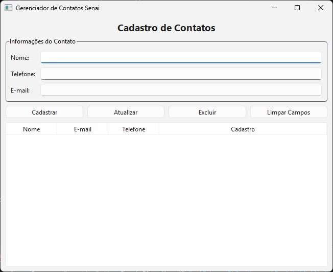
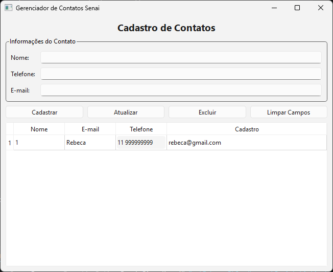

# 📇 Gestor de Contactos — Python PyQt6 & MySQL

Aplicação desktop completa para cadastro e gestão de contactos (CRUD), desenvolvida em **Python** com interface gráfica em **PyQt6** e integração com a base de dados **MySQL**[cite: 15, 16].

---

<div align="center">
  
  
</div>

---

## 🚀 Funcionalidades

- **🗄️️ Configuração Automática**: Criação automática da base de dados (`crud_contatos`) e da tabela de contactos no primeiro arranque.
- **➕ Registar Contactos**: Formulário intuitivo para inserção de nome, telefone e e-mail com validação de campos[cite: 15, 16].
- **📋 Listagem em Tempo Real**: Tabela interativa (`QTableWidget`) sincronizada com os dados armazenados no MySQL[cite: 15, 16].
- **✏️ Atualização de Registo**: Edição rápida de contactos existentes selecionados na tabela[cite: 15, 16].
- **🗑️ Exclusão Segura**: Remoção de contactos com caixa de confirmação de segurança[cite: 15, 16].
- **🧹 Limpeza de Campos**: Botão dedicado para redefinir o formulário.

---

## 📁 Estrutura do Projeto

```text
.
├── database.py   # Classe de gestão e ligação à base de dados MySQL (CRUD)
├── main_2.py     # Interface gráfica (GUI) desenvolvida com PyQt6
└── README.md     # Documentação do projeto
```

---

## 🛠️️ Tecnologias Utilizadas
* Linguagem: Python 3.x
* Interface Gráfica: PyQt6
* Base de Dados: MySQL
* Conector de Base de Dados: `mysql-connector-python`

---

## 📝 Arquitetura das Classes
### `Database` (`database.py`):
* `conectar()`: Estabelece a ligação com o servidor MySQL.
* `criar_banco()`: Garante a existência da base de dados.
* `criar_tabela()`: Cria a tabela contatos com os campos id, nome, `telefone` e `email`.
* `inserir()`, `atualizar()`, `excluir()`, `listar()`: Métodos responsáveis pela manipulação de registos[cite: 15].
### `MainWindow` (`main_2.py`):
* Constrói o layout visual, interliga os botões às funções do banco de dados e atualiza a tabela dinamicamente[cite: 16].
